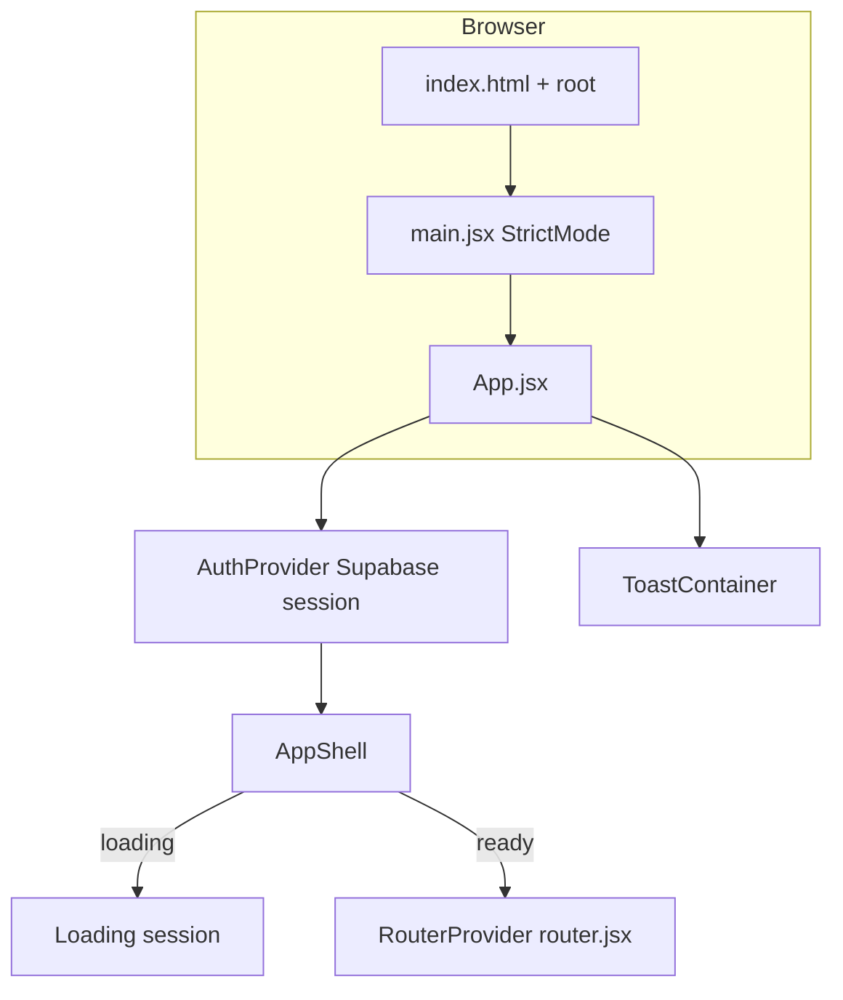
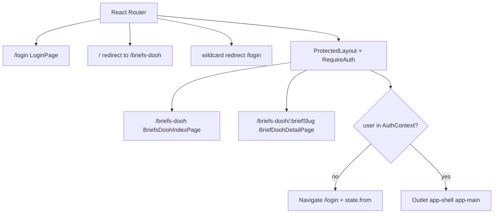
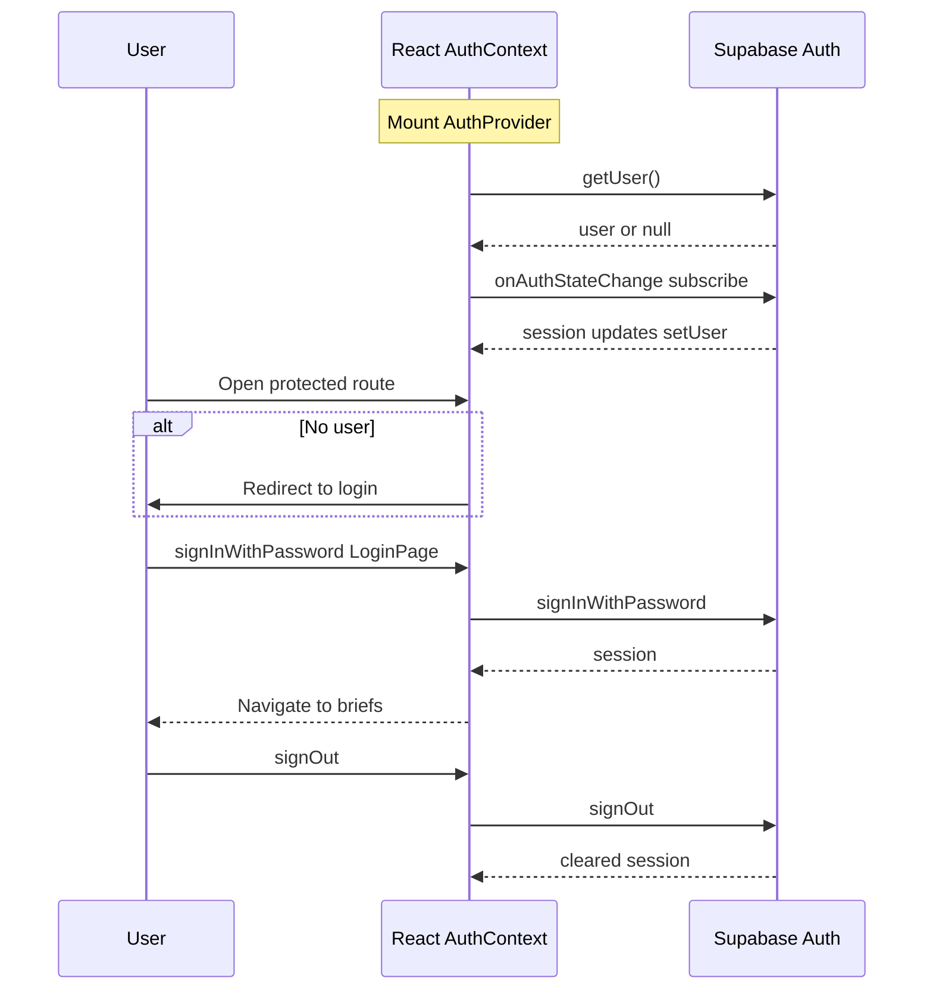
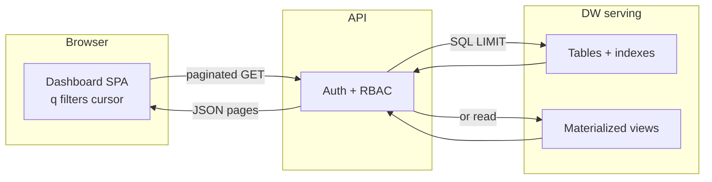

# doohBrief app flow (diagrams)

**If you see** `No diagram type detected` **and the error text starts with `# doohBrief`**, the viewer is feeding the **entire Markdown file** into Mermaid. Use either:

- **Markdown preview** that renders **each** fenced ` ```mermaid ` block on its own, or  
- **Diagram-only files** (no headings): `diagrams/doohBrief/bootstrap.mmd`, `routes.mmd`, `auth-sequence.mmd`, `asset-dw-summary.mmd`

---

## 1. Bootstrap and shell



---

## 2. Routing and protection (actual routes)



---

## 3. Auth sequence (Supabase)



---

## 4. Where this differs from the asset dashboard blueprint

The **asset dashboard** (separate product, described in `ASSET_DASHBOARD_PLATFORM_BLUEPRINT.md`) would add: authenticated **API to data warehouse** for search, list, and detail. This **doohBrief** repo today is a **SPA + Supabase auth** and DOOH feature pages; feature data flows are in `src/features/dooh/` (local or Supabase per your modules), not the DW pattern in the blueprint unless you wire that later.

---

## 5. Asset dashboard: indexes, search and display (summary)

Full Mermaid (serving layer, search sequence, optional search engine) is in **`ASSET_DASHBOARD_PLATFORM_BLUEPRINT.md`** under **Diagrams: indexes, materialized views, and search**. Use that file in **Markdown preview** (fenced blocks), not a single-diagram tool on the whole file.

Condensed request path (also as `diagrams/doohBrief/asset-dw-summary.mmd`):



- **Search** means the server runs filtered, sorted SQL using **indexes**, often against an **MV** shaped for the UI.
- **Display** means the same API returns paged rows for the grid and **GET-by-id** for detail; the SPA does not load the full catalog.
