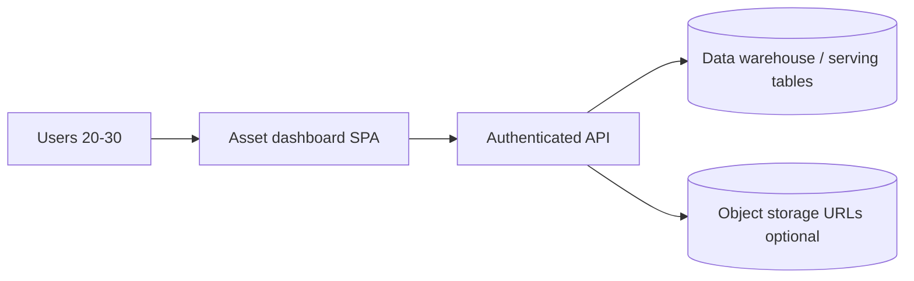
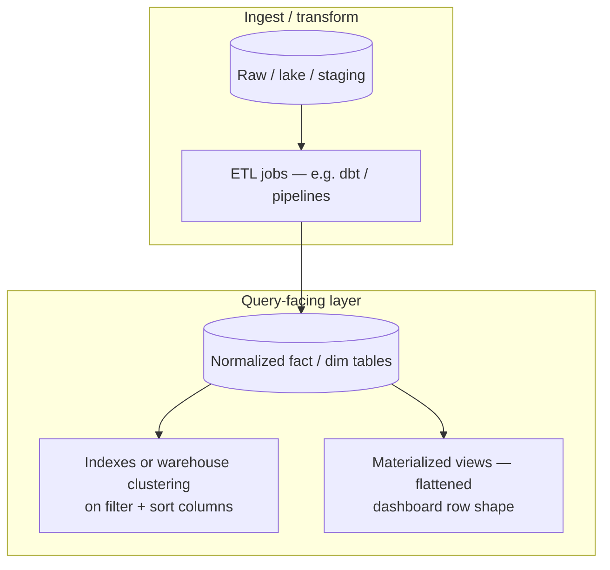
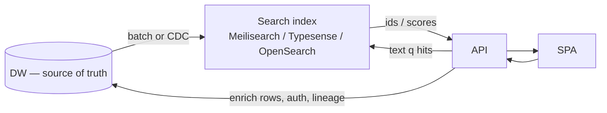

# Asset dashboard platform blueprint

**Scope:** A separate product from DOOH brief tooling. This document describes an internal **asset library / dashboard** backed by your **data warehouse (DW)** for asset metadata (and optionally object storage URIs). **DOOH application code does not need to change** to adopt this pattern.

**Where to keep this material:** This file and **`diagrams/asset-dashboard/`** only. Do **not** put asset-dashboard Markdown or Claude-only project docs under **`.claude/`** — that folder is for **DOOH** project context.

> **Mermaid:** Use **Markdown preview** so each diagram renders from its **own** fenced code block. Tools that send the **entire** `.md` into Mermaid will error (they see the `#` title first). Use diagram-only files in [`diagrams/asset-dashboard/`](diagrams/asset-dashboard/) if needed.

## Context

| Dimension | Guideline |
|-----------|-----------|
| Catalog size | ~100k asset records (files or logical assets) |
| Concurrent humans | ~20–30 |
| Identity | Authenticated users only (no public catalog) |
| Source of truth | DW (and/or lake tables) for listing, lineage, freshness; blobs in object storage if applicable |

---

## Client vs server boundaries (direct answer)

For bounded search over ~100k rows, **indexed DW reads** (plus optional MVs) are enough for list/search/detail—you **do not** substitute an in-memory product for a real **search/filter index** here. The **browser** must not replicate the warehouse: expose **paginated APIs** and use **React Query / TanStack Query** (or SWR) so the client caches **pages**, not the catalog.

Optional **later**—only if profiling shows the need—you might add centralized **sessions**, **rate limits**, **TTL cache** of repeated DW reads, or **background job** plumbing behind the API using whatever primitives your platform already favors.

---

## Recommended architecture (minimal, robust)

1. **Auth:** Your existing provider (e.g. OIDC, Supabase Auth, etc.). Dashboard behind auth; API checks JWT/session on every request.
2. **API layer (BFF or small service):**
   - Translates UI needs into **parameterized queries** against the DW (or a serving layer such as a materialized view / sync’d Postgres).
   - Returns **pages** (cursor or offset) and **facets** counts if needed.
3. **Search over ~100k rows:**
   - **Start:** DW SQL with appropriate **indexes / clustering / materialized views** on columns you filter (`brand`, `status`, `uploaded_at`, `path`, tags). For simple substring search on a few columns, DB **ILIKE**/trigram or warehouse-native text features may suffice.
   - **Scale text search later:** Dedicated engine (Meilisearch, Typesense, OpenSearch, Elasticsearch) fed by ETL from the DW—but only if ranking, fuzzy match, or sub-second exploratory search becomes a requirement.
4. **Client:**
   - **React Query** (or equivalent) for list/search/detail.
   - **URL-driven filters** (`?q=&brand=&cursor=`) for shareable bookmarks.
   - **Virtualized lists** for long result sets in the DOM.

---

## Server-side search and displaying information (same path)

**Searching** and **showing information** should use **one pattern**: authenticated API → **bounded SQL** against the DW (or a serving layer synced from it). The browser never loads the whole catalog (~100k rows).

### How it fits together

1. **Search / browse** — The SPA sends filters, text `q`, sort, and a **cursor or page** (`LIMIT` / keyset pagination). The API executes a single query against indexed DW tables or a **materialized view**-shaped for dashboards, then returns **one page** of rows (plus optional facet counts).
2. **Detail** — Grid/list rows usually include enough to render cards; opening a drawer or `/assets/:id` triggers a **follow-up GET by primary key** (or the list payload embeds slim detail if payloads stay small).
3. **Summary metrics** — Headline numbers (counts, quotas) come from **aggregate queries** or **pre-aggregated materialized views** refreshed on a schedule, not from scanning the SPA’s memory.

### Indexes vs materialized views

| Mechanism | Use for |
|-----------|---------|
| **Indexes / clustering / warehouse optimizations** | Fast filters and sorts on columns you actually query (`brand`, `status`, `uploaded_at`, `path`, tags, etc.). |
| **Materialized views** | A **dashboard-friendly**, denormalized snapshot (fewer joins per request); refresh hourly/nightly or on pipeline completion so each HTTP request stays cheap and predictable. |

### Client role

The client **only renders** whatever each response returns—list pages, detail JSON, thumbnails via signed/object URLs—not a replica of the full DW. **React Query** (or similar) caches those **pages**; do not mirror the searchable catalog in browser-global state meant for UI coordination.

### Optional later

If plain DW text matching is not enough (fuzzy ranking, instant typeahead at scale), add a **dedicated search index** fed from the DW; until then, **DW + indexes / MVs** covers search and display for this scale.

---

## Data flow (conceptual)



---

## Diagrams: indexes, materialized views, and search

Diagram-only copies (when a viewer cannot parse fenced Markdown blocks): **`diagrams/asset-dashboard/`** — `data-flow.mmd`, `serving-layer.mmd`, `search-list-detail.mmd`, `dedicated-search-engine.mmd`.

Use these with **Server-side search and displaying information** above.

### Serving layer: where indexes and MVs live



- **Indexes (or clustered keys):** accelerate `WHERE`, `JOIN`, `ORDER BY` the UI actually uses (brand, status, dates, path prefix, tags).
- **Materialized views:** pre-join/pre-shape so each API request reads **few tables** or one MV; refresh on a schedule or after loads.

### End-to-end: search / list / detail (one server path)

```mermaid
sequenceDiagram
  participant U as User
  participant SPA as Asset dashboard SPA
  participant API as Authenticated API
  participant DW as DW tables + indexes / MVs

  Note over SPA: URL params q, filters, cursor — not full catalog in memory
  U->>SPA: type search, change filters
  SPA->>API: GET /api/assets?q=...&...&cursor=...
  API->>API: verify JWT / session / RBAC
  API->>DW: parameterized query + LIMIT
  Note over DW: Planner uses indexes;<br/>or reads MV for slim rows
  DW-->>API: one page + optional facet aggregates
  API-->>SPA: JSON
  SPA-->>U: virtualized grid / list

  U->>SPA: open asset detail
  SPA->>API: GET /api/assets/:id
  API->>DW: primary-key lookup indexed row
  DW-->>API: single row
  API-->>SPA: detail + signed URL hints if needed
  SPA-->>U: drawer / detail view
```

### Optional later: dedicated text search alongside the DW

When fuzzy ranking or instant typeahead outgrows warehouse text features:



Until then **DW SQL + indexes + MVs** carries both **filter/sort search** and **display**.

---

## Security and compliance (auth-only internal tool)

- No anonymous routes for asset metadata or signed URLs unless time-limited and audited.
- Log **who** ran heavy exports or bulk downloads.
- Align retention and PII handling with DW policies; the dashboard is a **read-mostly lens** over governed data.

---

## Implementation checklist (non-DOOH)

- [ ] Route all reads through APIs that enforce auth and row-level constraints if required.
- [ ] **One server path for search + browse + detail** (paginated DW/MV reads; GET-by-id for full row when needed)—no full-catalog client replica.
- [ ] Pagination + hard caps on page size (`max 100` etc.).
- [ ] Indexes or materializations matching real filter/sort combinations.
- [ ] Client: server-state library + virtualization; avoid full-catalog client stores.
- [ ] Add optional API-side cache / sessions / rate limits / job queues only after profiling or ops requirements dictate it.

---

## Summary

| Technology | Role here |
|------------|-----------|
| **Search + display (~100k)** | Same **server path**: DW + indexes / MVs; paginated list; GET-by-id for detail; optional dedicated search engine later |
| **Client data** | Paginated fetch + React Query-style caching |

This keeps the asset dashboard **separate from DOOH** while reusing auth patterns where it makes sense, without loading the warehouse into the SPA.
